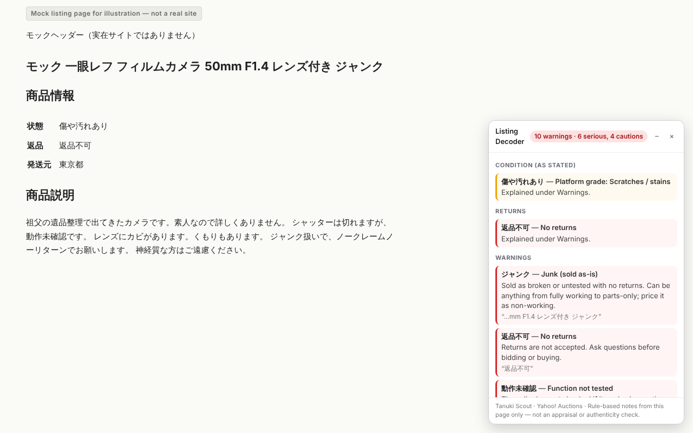
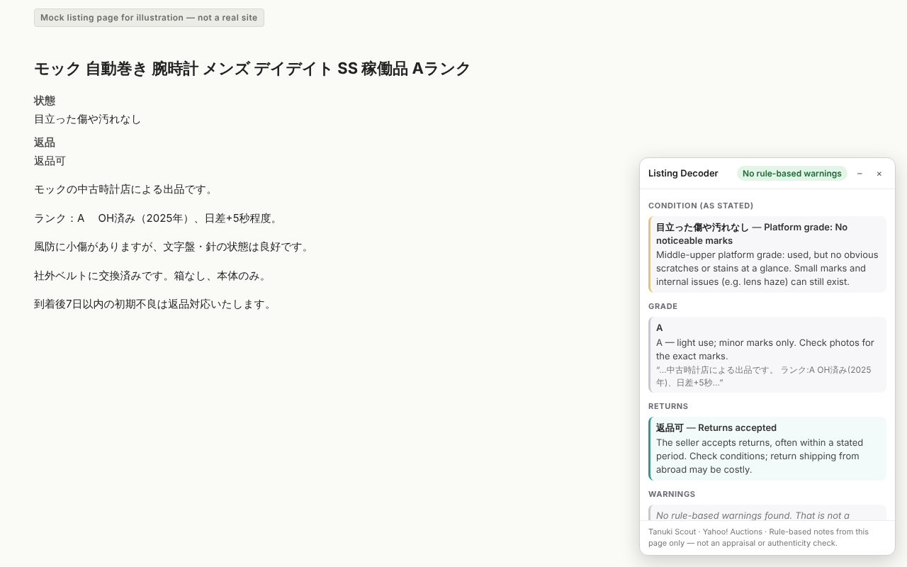

<!-- DRAFT — not published. Publishing requires owner approval. -->
<!-- Name pending trademark search (USPTO / J-PlatPat, classes 9 and 42). "Tanuki Scout" is the provisional name (HQ decision 2026-10-09); do not use as a final name until cleared. -->

<!--
オーナー向けの説明（日本語）：
待機リスト用ランディングページの原稿（下書き・未公開）です。海外のコレクター向けなので本文は英語です。
構成：見出し「入札の前に、日本語の細かい注意書きを読もう」→ 課題（「美品」のはずがカビ、時計の文字盤の塗り直し、機械翻訳の限界）→ 使い方3ステップ → 解説する用語の例 → プライバシーと権限 → 正直な限界（鑑定ではない、ルールベース、サイトの変更に弱い）→ FAQ → 待機リストのフォーム（未作成）。
公開にはオーナーの承認が必要です。名前は仮（docs/naming.md）。スクリーンショットは模擬ページです。
-->

# Tanuki Scout (working title)

## Read the Japanese fine print before you bid.

A Chrome extension for overseas collectors of vintage cameras and watches. It explains Japanese condition notes, shop grades and return terms in plain English, and flags risky wording like junk, untested, authenticity unknown, redial and fungus, right on the listing you're looking at.

Built for Yahoo! Auctions Japan first, then Mercari, Rakuma and Mandarake. Works alongside your usual proxy service.

`[WAITLIST FORM — not live]`

---

## The problem

Japan has listings you won't find anywhere else, written in condition notes you can't fully read.

- **"Near mint" turns out not to be.** Camera buyers describe lenses listed as almost perfect that arrived with haze or fungus the description seemed to rule out.
- **Watch listings hide redials and parts watches.** Collectors warn that auction listings are full of repainted dials and watches assembled from mixed parts, and that coordinated scams target overseas bidders.
- **Machine translation misses what matters.** A translator turns 動作未確認 into "operation unconfirmed." It won't tell you that in practice this usually means "assume it doesn't work, and you can't send it back."

A wrong guess is expensive: after proxy fees, shipping and duties, returns are rarely realistic.

---

## How it works

1. **Open a listing.** Browse Yahoo! Auctions Japan, Mercari, Rakuma or Mandarake the usual way.
2. **A panel appears in the corner.** It reads the listing on your screen and sorts what it finds into Condition, Grade, Returns, Warnings and Seller states.
3. **Decide with the full picture.** High-risk terms are flagged first. If the seller writes something reassuring, such as "no fungus or haze," it's listed under Seller states and not raised as a warning.

*Shown on a mock listing page*

*Shown on a mock listing page*

---

## What it flags

A sample from the built-in glossary:

| Japanese term | What it really means |
|---|---|
| ジャンク (junk) | Sold as broken or untested, with no returns. Could be anything from working to parts-only; price it as non-working. |
| 動作未確認 (function not tested) | The seller hasn't checked whether it works. Often this means it doesn't, or they suspect it doesn't. Treat it as junk. |
| ノークレームノーリターン (NCNR) | No claims, no returns. If you're buying through a proxy, assume you can't send it back. |
| 真贋不明 (authenticity unknown) | The seller won't say it's genuine. This is often how fakes get listed; assume it may not be real. |
| リダン (redial) | The dial has been repainted or reprinted. Collector value drops sharply, and fake vintage watches often have one. |
| カビ (fungus) | Mould growing inside the lens. It can etch coatings and spread, and removing it may leave marks. |
| くもり (haze) | Haze inside the lens that lowers contrast. Light haze may clean off; haze in cemented groups often can't. |
| バルサム切れ (balsam separation) | The cement between bonded lens elements has separated. Re-cementing is rarely worth the cost. |

It also explains shop grades (S / A / AB / B …) and exporter grades (Mint, Exc+++), and flags risky combinations such as "untested + no returns."

---

## Privacy & permissions

- **Only the page you have open.** It reads the listing in your current tab and nothing else. It never opens other pages or crawls.
- **Everything happens in your browser.** The glossary ships with the extension. It has no server and makes no network requests.
- **No account and no data collection.** Nothing is sent anywhere. The only thing it keeps is your estimate settings (destination, shipping method, exchange rate), stored on your device. Never the listing or the page address.
- **Minimal permissions.** It asks to read the four supported marketplace sites, which is what Chrome's install prompt will show, plus "storage" for your estimate settings.
- **It doesn't change the page.** It adds its own panel and leaves the listing exactly as the seller published it.

*(The waitlist form on this page is separate from the extension. It will only ask for an email address.)*

---

## Honest limitations

- **It doesn't appraise or check authenticity.** It explains what the seller wrote. It can't tell you whether the item is genuine, what it's worth or what condition it's really in.
- **It's rule-based.** It matches known terms and patterns from a curated glossary, so wording it doesn't recognize won't be flagged. A clean panel doesn't mean the item is safe.
- **Site layouts change.** It finds condition and return sections by their on-page labels. If a marketplace redesigns its pages, parts of the panel may stop working until it's updated.
- **Early prototype.** Cameras and watches come first; other categories are thinner.

---

## FAQ

**Is this affiliated with Yahoo! Auctions, Mercari, Rakuma or Mandarake?**
No. It's independent and not endorsed by or connected to any marketplace or proxy service.

**Does it buy items for me?**
No. It only helps you read listings. You still bid or buy through your usual proxy service.

**Will it tell me if a watch is fake?**
No. It flags wording that sellers commonly use around fakes and altered parts, such as "authenticity unknown" or "redial." It can't verify the item itself.

**What does it cost?**
The core decoder will be free. A Pro tier is planned. Details will come later.

**When can I try it?**
It isn't publicly available yet. Join the waitlist to hear when testing opens.

`[WAITLIST FORM — not live]`

---

Tanuki Scout (working title) is independent. Marketplace names are trademarks of their owners, used only to describe compatibility. Not an appraisal or authentication service. Screenshots show mock pages.
